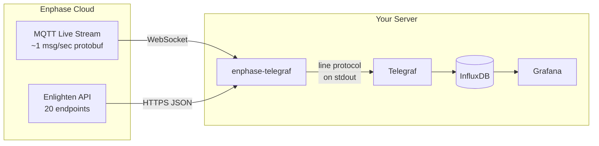
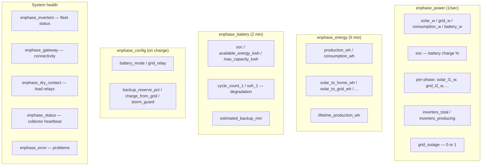
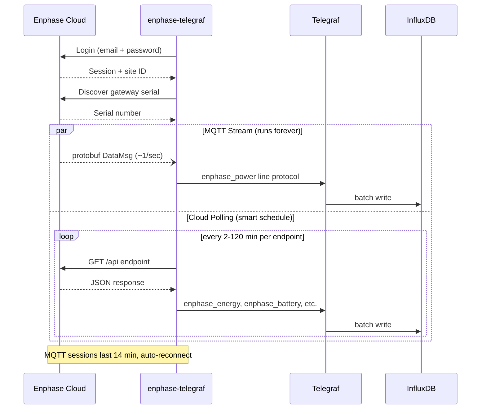
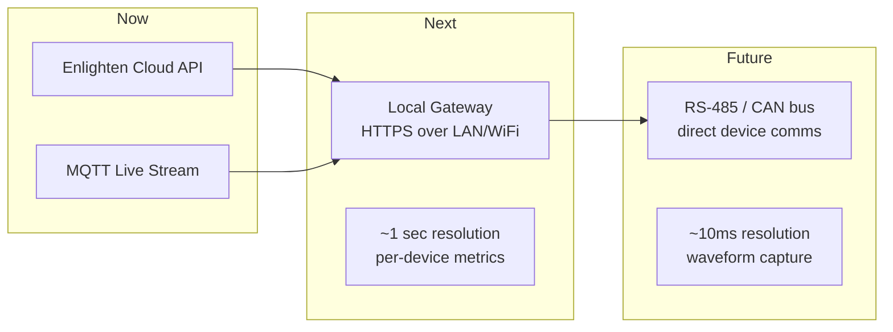

# enphase-telegraf

Real-time Enphase solar+battery monitoring. Streams data from the Enphase cloud
into InfluxDB — no local network access to your gateway required.



Two data sources, combined into one stream:

- **MQTT live stream** — protobuf power data at ~1 msg/sec (solar, grid, battery, consumption, per-phase, dry contacts)
- **Enlighten cloud API** — 20 endpoints polled on smart schedules (energy totals, battery health, device inventory, config changes)

## What are Telegraf and InfluxDB?

**[InfluxDB](https://www.influxdata.com/products/influxdb/)** is a time-series
database — it stores timestamped measurements (like "solar power was 3,200W at
2:03:41 PM"). It's designed for exactly this kind of data: millions of points,
fast queries over time ranges, automatic downsampling.

**[Telegraf](https://www.influxdata.com/time-series-platform/telegraf/)** is the
agent that feeds data into InfluxDB. It runs on your server and supports 300+
input plugins. This project is a Telegraf input plugin — it writes **InfluxDB
line protocol** to stdout, and Telegraf handles the rest (batching, retries,
buffering).

**InfluxDB line protocol** is a simple text format. Each line is one data point:

```
measurement,tag=value field=value timestamp
```

For example, this project outputs lines like:

```
enphase_power,serial=482525046373,source=mqtt solar_w=3200.5,grid_w=-1500.2,consumption_w=1700.3,battery_w=0.0,soc=85i 1711270800000000000
enphase_energy,serial=482525046373 production_wh=18238.0,consumption_wh=10230.0,solar_to_home_wh=5674.0 1711270800000000000
```

Anything that outputs this format to stdout works as a Telegraf input. This
project runs forever, printing one line per second of real-time power data plus
periodic cloud updates. Telegraf reads stdout and writes to InfluxDB. You then
query it with **Grafana**, the InfluxDB UI, or any tool that speaks Flux/SQL.

## Quick start

```bash
git clone https://github.com/mvalancy/enphase-telegraf.git
cd enphase-telegraf
./setup.sh         # installs everything, prompts for credentials, starts Telegraf
```

Data flowing in ~60 seconds. The setup script handles system packages (Telegraf,
InfluxDB, python3-venv), Python venv, protobuf compilation, credentials, Telegraf
config, and a connection test. If you already have Telegraf+InfluxDB configured,
it detects your existing InfluxDB credentials and only asks for Enphase login.

### Run standalone (no Telegraf needed)

If you just want to set up the Python environment without Telegraf:

```bash
./bin/setup                       # venv + proto + credentials only
./bin/enphase-telegraf --verbose   # prints line protocol to stdout
```

You can pipe the output anywhere — InfluxDB's `influx write` CLI, a file,
`curl` to any HTTP endpoint, or just watch it scroll by.

## Setting up Telegraf

The `setup.sh` script handles Telegraf + InfluxDB installation automatically.
For manual setup, see [`docs/SETUP_GUIDE.md`](docs/SETUP_GUIDE.md).

## What it collects



### Sign conventions

| Positive (+) | Negative (−) |
|-------------|-------------|
| Solar producing | — |
| Grid importing (buying from utility) | Grid exporting (selling back) |
| Home consuming | — |
| Battery discharging (powering home) | Battery charging (absorbing power) |

See [`docs/MEASUREMENT_TYPES.md`](docs/MEASUREMENT_TYPES.md) for the complete
field reference with units, value ranges, and physical explanations for every
field.

## Using as a Python library

The `enphase_cloud` package works standalone — no Telegraf needed:

```python
from enphase_cloud.enlighten import EnlightenClient
from enphase_cloud.livestream import LiveStreamClient

client = EnlightenClient("you@example.com", "your-password")
client.login()

# Read data
power = client.get_latest_power()
battery = client.get_battery_status()

# Control battery
client.set_battery_mode("self-consumption")
client.set_reserve_soc(20)
client.set_charge_from_grid(True)

# Stream live data (~1 msg/sec)
stream = LiveStreamClient(client)
stream.start("your-serial", on_data=lambda d: print(d))
```

See [`examples/`](examples/) for battery control CLI, cloud scraping, and
direct-to-InfluxDB streaming.

## Requirements

- Python 3.10+
- Enphase Enlighten account (email + password, no MFA)
- No local network access needed — works entirely via cloud

Only 3 pip dependencies: `requests`, `paho-mqtt`, `protobuf`.

## How it works



## Project structure

```
setup.sh                    Full setup (installs everything, one command)
bin/
  enphase-telegraf          Shell wrapper (sources .env, sets PYTHONPATH)
  load-history              Backfill InfluxDB with historical solar data
  setup                     Python-only setup (venv, proto, credentials, test)
conf/
  telegraf-enphase.conf     Drop-in Telegraf config (uses env vars, no secrets in file)
infra/
  scripts/                  InfluxDB + Grafana + Telegraf install scripts
    setup-hub.sh            Full monitoring stack (InfluxDB + Grafana + Telegraf)
    setup-collector.sh      InfluxDB only (init, admin user, tokens)
    setup-agent.sh          Telegraf agent only
  templates/                Config templates for InfluxDB, Telegraf, Grafana
src/
  enphase_telegraf.py       Telegraf entry point (line protocol to stdout)
  enphase_cloud/            Python package
    enlighten.py            Enlighten API (20 data getters + 6 control methods)
    livestream.py           MQTT protobuf stream (~1Hz real-time data)
    history.py              Historical data downloader (JSON cache)
    history_loader.py       Convert cached history → InfluxDB line protocol
    history_cli.py          Interactive CLI for bin/load-history
    proto/                  Compiled protobuf schemas
proto/                      Protobuf source files (.proto, for recompiling)
examples/                   Standalone scripts (battery control, cloud scrape, etc.)
tests/                      2,400+ pytest tests (unit, fuzz, e2e)
docs/
  README.md                 Documentation index with system diagram
  CLOUD_API.md              Enlighten REST API reference (20 endpoints)
  MQTT_LIVESTREAM.md        MQTT protocol, protobuf schemas, field mapping
  ARCHITECTURE.md           Threading, error handling, resilience design
  SETUP_GUIDE.md            Detailed setup walkthrough and troubleshooting
  TESTING.md                Test suite overview and design philosophy
  BATTERY_CONTROL.md        Battery modes, schedules, control API
  MEASUREMENT_TYPES.md      Complete InfluxDB field reference
```

## Documentation

The [`docs/`](docs/) folder has detailed references:

- [**Setup guide**](docs/SETUP_GUIDE.md) — full walkthrough, manual setup, infra scripts, troubleshooting
- [**Architecture**](docs/ARCHITECTURE.md) — threading model, error handling, resilience design
- [**Cloud API**](docs/CLOUD_API.md) — all 20 Enlighten endpoints, auth flow, response structures
- [**MQTT live stream**](docs/MQTT_LIVESTREAM.md) — AWS IoT connection, protobuf schemas, field mapping
- [**Measurement types**](docs/MEASUREMENT_TYPES.md) — every InfluxDB field with type, unit, range
- [**Battery control**](docs/BATTERY_CONTROL.md) — modes, reserve, schedules, charge-from-grid
- [**Testing**](docs/TESTING.md) — 2,400+ test suite, how to run, design philosophy

## Roadmap



**Current: Cloud-only (v1)** — works anywhere, no local network access needed.
All data comes from Enphase cloud via MQTT (real-time) and REST API (polled).

**Next: Local gateway (v2)** — direct HTTPS connection to the IQ Gateway on
your LAN/WiFi. Higher resolution (~1 sec per device vs aggregated), per-inverter
and per-battery metrics, CT meter readings with per-phase voltage/current/power
factor. Requires local network access to the gateway (192.168.x.x). Uses
gateway JWT token from Enlighten for authentication. The `enphase_cloud` package
already has `get_gateway_token()` for this.

**Future: Direct bus access (v3)** — RS-485/CAN/Zigbee connection to Enphase
devices, bypassing the gateway entirely. Millisecond-resolution power data,
waveform capture, direct inverter control. Requires physical access to the
communication bus. Research phase.

## Legal notice

This project uses reverse-engineered Enphase APIs. It is not affiliated with or
endorsed by Enphase Energy, Inc. Use at your own risk. You are responsible for
ensuring your use complies with Enphase's Terms of Service and applicable laws.

## License

MIT
