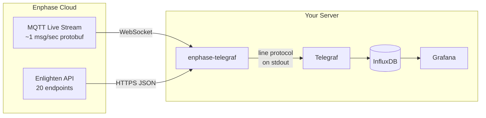
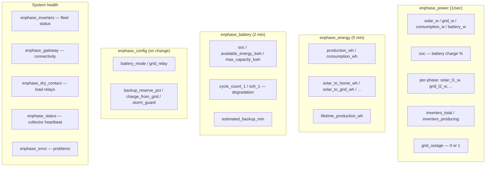
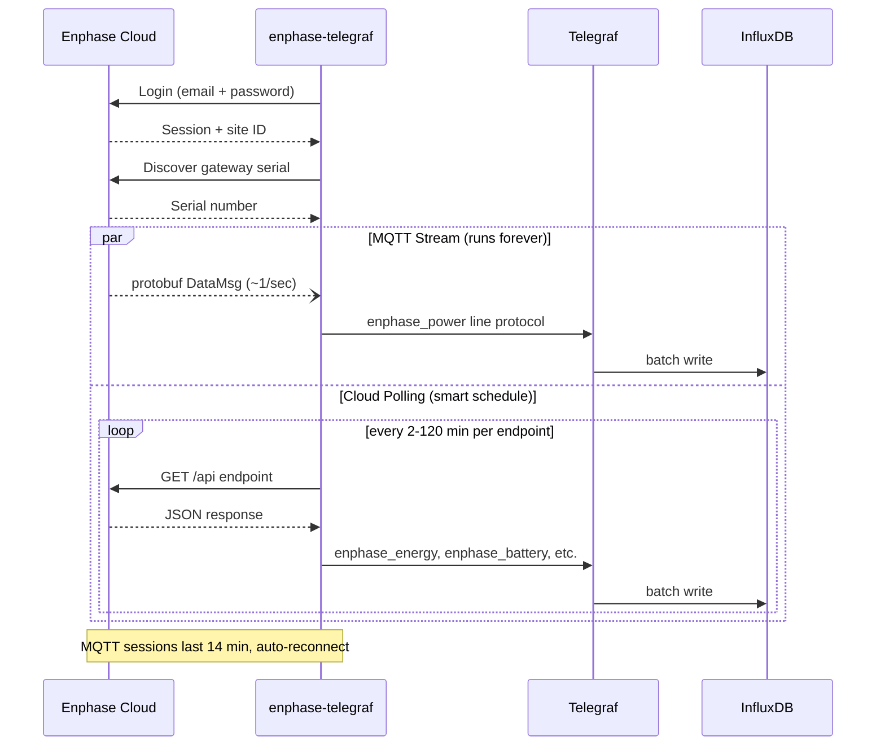

# enphase-telegraf

Real-time Enphase solar+battery monitoring. Streams data from the Enphase cloud
into InfluxDB — no local network access to your gateway required.



Two data sources, combined into one stream:

- **MQTT live stream** — protobuf power data at ~1 msg/sec (solar, grid, battery, consumption, per-phase, dry contacts)
- **Enlighten cloud API** — 20 endpoints polled on smart schedules (energy totals, battery health, device inventory, config changes)

## What are Telegraf and InfluxDB?

**[InfluxDB](https://www.influxdata.com/products/influxdb/)** is a time-series
database — it stores timestamped measurements (like "solar power was 3,200W at
2:03:41 PM"). It's designed for exactly this kind of data: millions of points,
fast queries over time ranges, automatic downsampling.

**[Telegraf](https://www.influxdata.com/time-series-platform/telegraf/)** is the
agent that feeds data into InfluxDB. It runs on your server and supports 300+
input plugins. This project is a Telegraf input plugin — it writes **InfluxDB
line protocol** to stdout, and Telegraf handles the rest (batching, retries,
buffering).

**InfluxDB line protocol** is a simple text format. Each line is one data point:

```
measurement,tag=value field=value timestamp
```

For example, this project outputs lines like:

```
enphase_power,serial=482525046373,source=mqtt solar_w=3200.5,grid_w=-1500.2,consumption_w=1700.3,battery_w=0.0,soc=85i 1711270800000000000
enphase_energy,serial=482525046373 production_wh=18238.0,consumption_wh=10230.0,solar_to_home_wh=5674.0 1711270800000000000
```

Anything that outputs this format to stdout works as a Telegraf input. This
project runs forever, printing one line per second of real-time power data plus
periodic cloud updates. Telegraf reads stdout and writes to InfluxDB. You then
query it with **Grafana**, the InfluxDB UI, or any tool that speaks Flux/SQL.

## Quick start

```bash
git clone https://github.com/mvalancy/enphase-telegraf.git
cd enphase-telegraf
./bin/setup        # creates venv, compiles proto, prompts for credentials, tests connection
```

Data flowing in ~30 seconds.

### Run standalone (no Telegraf needed)

```bash
./bin/enphase-telegraf --verbose
```

This prints line protocol to stdout and status to stderr. You can pipe it
anywhere — InfluxDB's `influx write` CLI, a file, `curl` to any HTTP endpoint,
or just watch it scroll by.

## Setting up Telegraf

### 1. Install Telegraf + InfluxDB

```bash
# Ubuntu/Debian
sudo apt install telegraf influxdb2

# Or via Docker
docker run -d -p 8086:8086 influxdb:2.7
docker run -d --net=host telegraf
```

### 2. Configure InfluxDB

Open `http://localhost:8086`, create an org, bucket (`enphase`), and API token.

### 3. Set credentials

Telegraf reads environment variables. The cleanest way:

```bash
# Create a credentials file for Telegraf's systemd service
sudo tee /etc/default/telegraf << 'EOF'
ENPHASE_EMAIL=you@example.com
ENPHASE_PASSWORD=yourpassword
INFLUXDB_URL=http://localhost:8086
INFLUXDB_TOKEN=your-api-token-from-step-2
INFLUXDB_ORG=your-org
INFLUXDB_BUCKET=enphase
EOF
sudo chmod 600 /etc/default/telegraf
```

### 4. Install the Telegraf config

```bash
sudo cp conf/telegraf-enphase.conf /etc/telegraf/telegraf.d/enphase.conf
```

Edit `/etc/telegraf/telegraf.d/enphase.conf` — the only thing to change is the
path to the `enphase-telegraf` script:

```toml
[[inputs.execd]]
  command = ["/path/to/enphase-telegraf/bin/enphase-telegraf"]
  signal = "none"
  data_format = "influx"
  restart_delay = "30s"

[[outputs.influxdb_v2]]
  urls = ["${INFLUXDB_URL}"]
  token = "${INFLUXDB_TOKEN}"
  organization = "${INFLUXDB_ORG}"
  bucket = "${INFLUXDB_BUCKET}"
```

The `${...}` variables are expanded from the environment file you created in
step 3. No credentials in the config file.

### 5. Start

```bash
sudo systemctl restart telegraf
```

Data should appear in InfluxDB within seconds. Check with:

```bash
journalctl -u telegraf -f          # watch Telegraf logs
influx query 'from(bucket:"enphase") |> range(start: -5m) |> limit(n:5)'
```

## What it collects



### Sign conventions

| Positive (+) | Negative (−) |
|-------------|-------------|
| Solar producing | — |
| Grid importing (buying from utility) | Grid exporting (selling back) |
| Home consuming | — |
| Battery discharging (powering home) | Battery charging (absorbing power) |

See [`docs/MEASUREMENT_TYPES.md`](docs/MEASUREMENT_TYPES.md) for the complete
field reference with units, value ranges, and physical explanations for every
field.

## Using as a Python library

The `enphase_cloud` package works standalone — no Telegraf needed:

```python
from enphase_cloud.enlighten import EnlightenClient
from enphase_cloud.livestream import LiveStreamClient

client = EnlightenClient("you@example.com", "your-password")
client.login()

# Read data
power = client.get_latest_power()
battery = client.get_battery_status()

# Control battery
client.set_battery_mode("self-consumption")
client.set_reserve_soc(20)
client.set_charge_from_grid(True)

# Stream live data (~1 msg/sec)
stream = LiveStreamClient(client)
stream.start("your-serial", on_data=lambda d: print(d))
```

See [`examples/`](examples/) for battery control CLI, cloud scraping, and
direct-to-InfluxDB streaming.

## Requirements

- Python 3.10+
- Enphase Enlighten account (email + password, no MFA)
- No local network access needed — works entirely via cloud

Only 3 pip dependencies: `requests`, `paho-mqtt`, `protobuf`.

## How it works



## Project structure

```
bin/
  enphase-telegraf          Shell wrapper (sources .env, sets PYTHONPATH)
  setup                     One-time setup (venv, proto, credentials, test)
conf/
  telegraf-enphase.conf     Drop-in Telegraf config (uses env vars, no secrets in file)
src/
  enphase_telegraf.py       Telegraf entry point (line protocol to stdout)
  enphase_cloud/            Python package
    enlighten.py            Enlighten API (20 data getters + 6 control methods)
    livestream.py           MQTT protobuf stream (~1Hz real-time data)
    history.py              Historical data downloader
    proto/                  Compiled protobuf schemas
proto/                      Protobuf source files (.proto, for recompiling)
examples/                   Standalone scripts (battery control, cloud scrape, etc.)
docs/
  MEASUREMENT_TYPES.md      Complete InfluxDB field reference
```

## Legal notice

This project uses reverse-engineered Enphase APIs. It is not affiliated with or
endorsed by Enphase Energy, Inc. Use at your own risk. You are responsible for
ensuring your use complies with Enphase's Terms of Service and applicable laws.

## License

MIT
