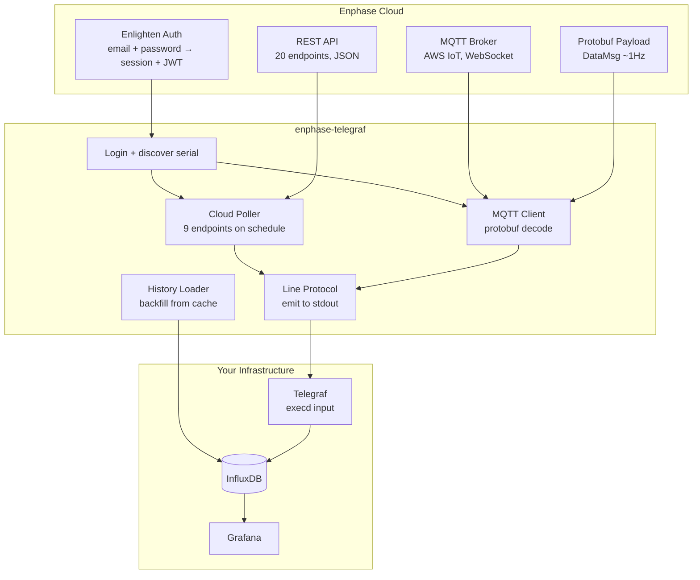

# Documentation

## Guides

| Document | Description |
|----------|-------------|
| [SETUP_GUIDE.md](SETUP_GUIDE.md) | Full setup walkthrough: interactive setup, manual setup, infrastructure scripts, historical backfill, environment variables, troubleshooting |
| [ARCHITECTURE.md](ARCHITECTURE.md) | Internal design: threading model, data flow, error handling, resilience, schema validation, anomaly detection, signal handling |
| [TESTING.md](TESTING.md) | 2,411-test suite: how to run, what each file covers, design philosophy, bugs found, how to add tests |

## API references

| Document | Description |
|----------|-------------|
| [CLOUD_API.md](CLOUD_API.md) | Enlighten REST API: authentication flow, all 20 endpoints with URLs and response structures, battery control methods, rate limiting |
| [MQTT_LIVESTREAM.md](MQTT_LIVESTREAM.md) | MQTT live stream: connection flow, AWS IoT auth, protobuf schemas, field mapping, session management, reconnection |
| [MEASUREMENT_TYPES.md](MEASUREMENT_TYPES.md) | InfluxDB output: all 9 measurements, every field with type/unit/range, sign conventions, data source tags |
| [BATTERY_CONTROL.md](BATTERY_CONTROL.md) | Battery API: modes, reserve, charge-from-grid, storm guard, schedules, CLI tool, SOC vs reserve explained |

## Quick navigation

**"I want to..."**

- **Set up from scratch** → [SETUP_GUIDE.md](SETUP_GUIDE.md)
- **Understand how it works** → [ARCHITECTURE.md](ARCHITECTURE.md)
- **Query data in InfluxDB/Grafana** → [MEASUREMENT_TYPES.md](MEASUREMENT_TYPES.md)
- **Control my battery** → [BATTERY_CONTROL.md](BATTERY_CONTROL.md)
- **Build something with the Enphase API** → [CLOUD_API.md](CLOUD_API.md)
- **Work with the MQTT stream** → [MQTT_LIVESTREAM.md](MQTT_LIVESTREAM.md)
- **Run or write tests** → [TESTING.md](TESTING.md)
